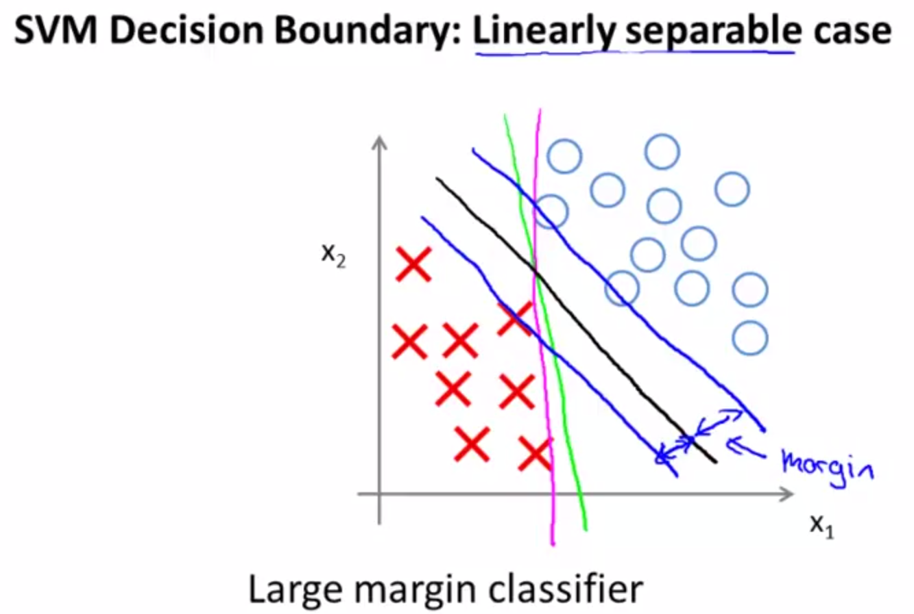
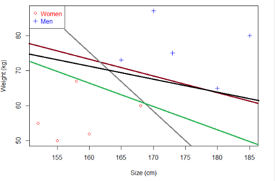

## Definition

First, Wikipedia tells us that SVMs can be used to do two things: classification or regression.

* SVM is used for classification
* SVR (Support Vector Regression) is used for regression
So it makes sense to say that there are several Support Vector Machines. [(source)][1]

## The History of SVMs
1. The original Maximal Margin Classifier 
2. The kernelized version using the Kernel Trick which allows the use of SVM to classify linearly nonseparable data.
3. The soft-margin version (controlled by the hyperparameter C) that allows some misclassifications
4. The soft-margin kernelized version (which combine 1, 2 and 3, thus most widely used)

### The Original 

-  learns a **seperating hyperplane** that classifies the data points. For example: if our data points lay in R2, the algorithm would simply produce a line seperating the data; in R3 it would produce a plane and so on, so we call it a hyperplane collectively.
    
- However, there can be many seperating hyperplanes. Which one should the algorithm produce?
    
The answer is that the algorithm will return the hyperplane with the greatest margin (max sum of distances from each data point projected onto said hyperplane). Why? The greatest margin makes our predictions more robust and less prone to noises, so we'll get better predictions when using the trained SVM on unseen data. 
* To edit the first bullet point, the objective of a SVM is not just to find **a** seperating hyperplane, but to find the **optimal** one.
* **Support Vectors** are the datapoints that the margin pushes up against which implies that only these data points are important; other training examples can be ignored.

### The Kernel trick

Kernel methods are NOT unique to SVM. This is a popular misconception. If you look at the objective function for logistic regression you will see that it is just as easy to use the kernel trick. 

SVM is basically logistic regression with L2 regularization and a slightly different loss function (SVM uses hinge loss while logistic uses log loss). [(source)][2]

If the data points are not linearly separable in 2D, you want to transform them to a higher dimension where they will be linearly separable. Imagine "raising" the green points, then you can sepparate them from the red points with a plane (hyperplane)

To "raise" the points you use the RBF kernel, gamma controls the shape of the "peaks" where you raise the points. A small gamma gives you a pointed bump in the higher dimensions, a large gamma gives you a softer, broader bump.

So a small gamma will give you low bias and high variance and vice versa. [(Source)][6]

Intuitively, the gamma parameter defines how far the influence of a single training example reaches, with low values meaning ‘far’ and high values meaning ‘close’. The gamma parameters can be seen as the inverse of the radius of influence of samples selected by the model as support vectors. (FROM ANDREW NG)

### The Soft Margin version

introduced the Soft Margin Classifier which allows us to accept some misclassifications when using a SVM.

A high C seeks to classify everything correctly
by giving the model freedom to select more samples as support vectors. However, this can lead to poorly fit models (the hyperplane is not "smooth") if any examples are mislabeled or extremely unusual, i.e. our dataset is noisy. To account for this, in 1995, Cortes and Vapnik proposed the idea of a "soft margin" SVM that allows some examples to be "ignored" or placed on the wrong side of the margin; this innovation often leads to a better overall fit [(Souce)][5]. **C** is the parameter for the soft margin cost function, which controls the influence of each individual support vector.  

### We usually find the best C and Gamma hyper-parameters using Grid-Search.

### Pros and Cons
| Number | Pros| Cons|
|:---:|:---:|:---:|
|1 |Once a hyperplane is found, most of the data other than the support vectors become redundant. This means that small changes to data cannot greatly affect the hyperplane and hence the SVM => SVMs tend to generalize very well.[(Source)][3]| If you have a large dataset with many features, SVMs can run very slowly
|2|Use of kernels (which are well-researched and can be custom-tailored/engineered to your needs)  | Choosing the appropriate kernel function and hyperparameters can be tricky| 
|3|The absence of local minima (categorized as convex optimization problem that can be solved by SMO)| | 
| | | |

[1]:  https://www.svm-tutorial.com/2017/02/svms-overview-support-vector-machines/

[2]: https://www.quora.com/What-are-the-advantages-of-support-vector-machines-SVM-compared-with-linear-regression-or-logistic-regression/answers/6394697?srid=ugxJO

[3]: http://www.simafore.com/blog/bid/112816/When-do-support-vector-machines-trump-other-classification-methods

[4]: https://stats.stackexchange.com/a/24440/165795

[5]:
https://www.quora.com/What-are-C-and-gamma-with-regards-to-a-support-vector-machine/answer/Jeffrey-M-Girard?srid=ugxJO

[6]: 
https://www.quora.com/What-are-C-and-gamma-with-regards-to-a-support-vector-machine/answer/Luis-Argerich?srid=ugxJO